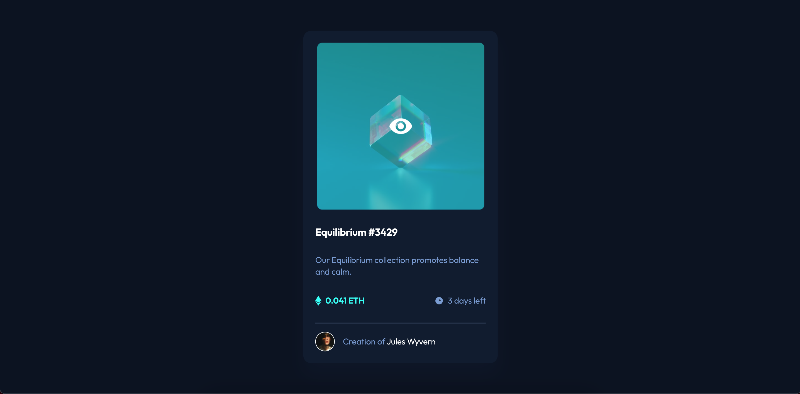

# Frontend Mentor - NFT preview card component solution

This is a solution to the [NFT preview card component challenge on Frontend Mentor](https://www.frontendmentor.io/challenges/nft-preview-card-component-SbdUL_w0U). Frontend Mentor challenges help you improve your coding skills by building realistic projects.

## Table of contents

- [Overview](#overview)
  - [Screenshots](#screenshot)
  - [Links](#links)
- [My process](#my-process)
  - [Built with](#built-with)
  - [What I learned](#what-i-learned)
- [Author](#author)

## Overview

### Screenshots

### Links

- Solution URL: [click!](https://github.com/dimxn/nft-preview-card-component-main/)
- Live Site URL: [click!](https://dimxn.github.io/nft-preview-card-component-main/)

## My process

### Built with

- Semantic HTML5 markup
- CSS custom properties
- CSS Grid
- Mobile-first workflow

### What I learned

## Author

- Website - [dmytror.pp.ua](https://www.dmytror.pp.ua/)
- Frontend Mentor - [@dimxn](https://www.frontendmentor.io/profile/dimxn)
- Instagram - [@dmytr.off](https://www.instagram.com/dmytr.off)
